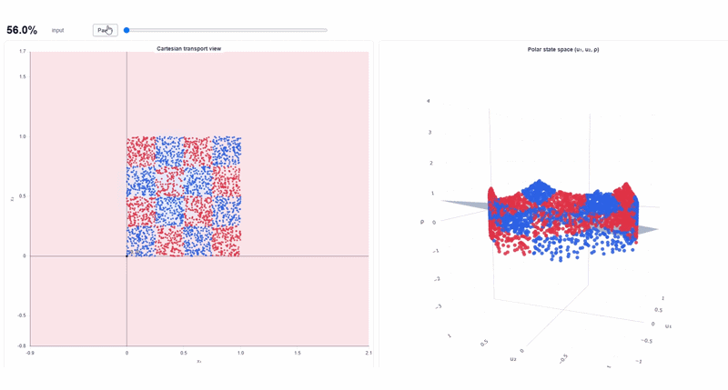
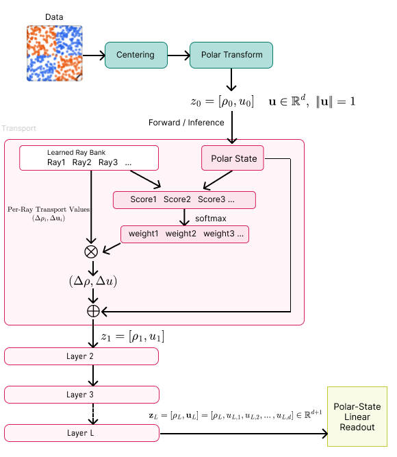

# Anchor-based Additive Transport (AAT)

AAT 是一种非线性分类算法。它首先将输入转换为归一化的径向—方向状态，然后让每个样本对一组可训练的 ray anchors 产生响应，并根据响应权重混合每条 ray 所携带的搬运值，使样本在多层加性搬运中逐渐变得更容易分类。

简单来说：*输入特征 → 中心化与极坐标变换 → ray 响应与权重计算 → 加性搬运 → 线性读出*

<p align="center">
  
</p>
<p align="center">  <em>Visualization of sample transport in AAT on 2D Checkerboard classification task.</em></p>

AAT 不以堆叠大规模稠密矩阵作为主要建模方式，而是通过状态相关的 ray 响应混合可训练搬运值，逐层更新样本状态，并最终由线性分类头完成分类。

## 为什么做 AAT？

在现代神经网络中，许多表示学习过程都依赖大规模矩阵变换。矩阵计算在 GPU 上非常高效，也已经被证明具有强大的建模能力。

然而，这并不意味着矩阵变换是演化数据表示的唯一方式。AAT 来自一个简单的几何直觉：

> 如果分类的最终目标，是让不同类别的样本在空间中更容易被区分，那么我们能否直接学习“如何移动这些样本”，而不是只通过一层层矩阵映射间接改变它们？这促使我们探索一种不以大规模稠密矩阵变换为主要建模方式的结构。

这使模型具有一种非常直观的解释：**每一层都会根据样本的当前状态计算其对一组可训练 rays 的响应，并通过响应权重混合对应的搬运值，使样本逐渐形成更加容易分离的状态表示。**

## 快速开始

### 1. 安装

建议在虚拟环境中安装依赖：

```bash
pip install git+https://github.com/1croyable/AAT.git@main
```

如果项目已经配置了本地包安装，也可以使用：

```bash
pip install -e .
```

### 2. 基本使用

```python
import torch
import torch.nn.functional as F

from AAT import AAT, AATConfig

device = torch.device("cuda" if torch.cuda.is_available() else "cpu")

cfg = AATConfig.from_data(
    train_x,
    num_classes=xxx,  # number of classes
    layers=xxx,       # number of transport layers
    rays=xxx,         # number of rays in each layer
)

model = AAT(cfg).to(device)

# Fit the center and radial normalization range from training data
model.fit_state(train_x)

optimizer = torch.optim.AdamW(model.parameters(), lr=1e-3)

for x, y in train_loader:
    x = x.to(device)
    y = y.to(device)

    logits = model(x)
    loss = F.cross_entropy(logits, y)

    optimizer.zero_grad()
    loss.backward()
    optimizer.step()
```

`rays` 可以是一个整数，表示所有层使用相同数量的 rays：

```
rays=32
```

也可以为每一层分别指定数量：

```
rays=[16, 24, 32, 32]
```

### 3. 推理

```python
model.eval()

with torch.no_grad():
    x = x.to(device)
    logits = model(x)
    pred = logits.argmax(dim=1)
```

### 4. 保存和加载

```python
model.save_checkpoint("aat.pt") # 保存，会连同配置和权重一起保存下来
```

```python
model = AAT.from_checkpoint("aat.pt", map_location=device) # 加载模型
```

## 模型结构



AAT 可以概括为三个阶段：状态转换、加性搬运和线性分类。

### 1. Polar State Construction

AAT 首先对输入特征进行中心化，并将每个样本转换为由归一化半径 $\rho$ 和单位方向向量 $\mathbf{u}$ 组成的极坐标状态：

$$
\mathbf{z}_0=[\rho_0,\mathbf{u}_0]
$$

------

### 2. Ray Response and Additive Transport

每一层包含一组可训练 rays。样本会根据当前状态计算对每条 ray 的响应分数，并通过 softmax 得到对应的响应权重。

每条 ray 同时携带一组独立的径向和方向搬运值。模型使用响应权重对这些搬运值进行加权混合，并以残差形式更新当前状态。方向向量在每次更新后重新归一化。

这一过程在多层之间重复进行，使样本状态逐步发生变化。

------

### 3. Linear Readout

经过 $L$ 层搬运后，最终状态表示为：

$$
\mathbf{z}_L=[\rho_L,\mathbf{u}_L]
$$

AAT 使用一个简单的线性分类头直接读取最终状态并输出类别预测。训练过程因此会推动前面的搬运层，将样本转换为更容易被线性分类的状态表示。

## 当前实验观察

当前实验表明：

- AAT 能够在 checkerboard、Swiss roll 和 triple helix 等低维任务上学习复杂的非线性分类边界，代表性测试准确率分别达到约 97.8%、97% 以上和 94%；
- 在 Airline Satisfaction 等真实表格数据上，AAT 在相同或相近参数量下，尤其是在小参数规模下，展现出明显优于 MLP 的参数效率，并在部分设置中同时取得更高的分类性能。
- 在展平后的 784 维 MNIST 上，8 层、每层 48 条 rays 的 AAT 达到了 98.51% 的最佳验证准确率和 98.26% 的测试准确率；
- 这些结果表明，AAT 的建模能力并不局限于低维可视化任务，而能够扩展到表格数据和高维展平图像；
- 扩展实验表明，AAT 随层数和 ray 数量增加会逐渐进入性能平台期；合适的层数与 ray 组合通常已能取得良好结果，其中增加 rays 往往比继续加深网络更稳定有效。
- AAT 当前训练速度和硬件执行效率仍有改进空间；
- 搬运过程可以被逐层可视化，从而直接观察样本状态如何在多层 transport 中发生变化并逐渐变得更容易分类。如MNIST


## 许可证

本项目使用 MIT License。

你可以自由使用、修改和分发本项目代码，但需要保留原始版权声明。
