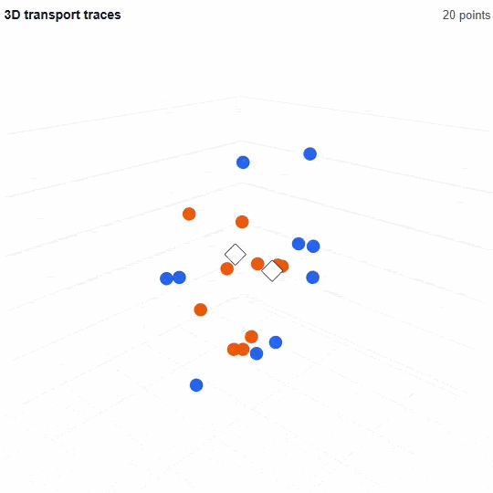

# AATField

**基于锚点的加性搬运场 (Anchor-based Additive Transport Field)**

一种非线性分类模型。它把样本看作状态空间中的一个点，并学习一个由锚点诱导的搬运场，使样本状态在这个可学习场中逐层移动，最终完成分类。

简单地说：*样本状态 → 观察锚点并产生搬运方向与强度 → 残差更新 → 线性读取*

<p align="center">
  
  
</p>

AATField 的目标不是堆叠更大的矩阵，而是探索一种更几何化、更场化的表示演化方式：**让样本在状态空间中被逐步搬运到更容易分类的位置。**

## 为什么做 AATField？

现代神经网络中，许多表示学习过程都依赖大规模矩阵变换。矩阵计算在 GPU 上非常高效，也已经被证明极其强大。

但这并不意味着矩阵变换是唯一的表示演化方式。AATField 来自一个简单的几何直觉：

> 如果分类的目标最终是让不同类别的样本在空间中变得更容易分开，那么是否可以直接学习“如何移动这些样本”，而不是只通过一层层矩阵映射去间接改变它们？由此可以探索一种不以大规模可训练权重矩阵为容量主要来源的结构。

这种方式使模型具有一种非常直观的解释：**每一层都在对样本状态施加一组局部的几何搬运，让样本逐渐进入更可分的空间结构**。

## 快速开始

### 1. 安装

建议在虚拟环境中安装依赖：

```bash
pip install git+https://github.com/1croyable/AATField.git@main
```

如果项目已经配置了本地包安装，也可以使用：

```bash
pip install -e .
```

### 2. 基本使用

```python
import torch
import torch.nn.functional as F

from aatfield import AATField, AATFieldConfig

device = torch.device("cuda" if torch.cuda.is_available() else "cpu")

cfg = AATFieldConfig.from_data(
    train_x,
    num_classes=xxx, # 该任务的分类数量
    extra_dims=xxx, # 写入数字表示额外的维度数 x2表示扩大两倍 x3表示扩大三倍
    layers=xxx, # 层数
    max_children=xxx, # 每层初始化推断子吸引子数的最大上限
)

model = AATField(cfg).to(device)

# 需要先根据训练数据进行结构初始化先验
model.initialize(train_x, train_y)

optimizer = torch.optim.AdamW(model.parameters(), lr=1e-3) # 在初始化后创建

for x, y in train_loader:
    x = x.to(device)
    y = y.to(device)

    logits = model(x)
    loss = F.cross_entropy(logits, y)

    optimizer.zero_grad()
    loss.backward()
    optimizer.step()
```

### 3. 推理

```python
model.eval()
with torch.no_grad():
    logits = model(x)
    pred = logits.argmax(dim=1)
```

## 模型结构


AATField 可以被概括为三个动作：观察、搬运、分类

### 1. 状态空间：在更高维中观察样本

AATField 会首先把原始输入提升到一个更高维的状态空间中。

模型首先在状态空间中放置一组可学习 anchors。这些 anchors 不是普通的隐藏神经元，而是用于定义局部几何场的参考点。样本会根据自己与 anchors 的距离关系，获得不同的响应强度。

这种设计来自一个直观假设：手中可见的数据只是更高维真实信息的低维投影。一个分类结果可能受到许多未被观测到的因素影响，而模型无法直接恢复这些隐藏因素。因此，AATField 不试图还原真实高维信息，而是**通过学习搬运场，在扩展后的状态空间中重新组织已有投影信息**，使样本逐渐变得更容易分类。

------

### 2. 产生搬运：方向、强度与激活

每个 anchor 会对样本产生一组 contribution，多个 contributions 会被加总成一个整体搬运向量。一个 contribution 同时包含：

- 方向：样本应该往哪里移动；
- 强度：这次移动有多大；

多个 anchor contributions 会被组合成一个整体搬运向量，然后以残差形式更新样本状态。为了增强非线性表达能力，AATField 可以在搬运生成过程或状态更新之后加入非线性调制，使搬运场不只是平滑地弯曲空间，而能够形成更灵活的局部变形、边界转折与状态重排。

------

### 3. 线性读取：让搬运后的空间变得可分

AATField 最后使用一个简单的线性分类头。这个设计为了给搬运过程提供一个明确目标：让样本经过多层搬运后，在最终状态空间中尽可能变得线性可分。

它不是把所有点压到某个固定形状上，而是**像扭动橡皮泥一样，对状态空间进行局部拉伸、折叠和重排**，使分类边界在最终空间中变得更简单。

## 当前实验观察

初步实验显示：

- AATField 可以在二维几何分类任务中形成有效的非线性边界；
- 在 moons、spiral 和 checkerboard 等低维几何任务中，AATField 展示出较强的几何归纳偏置；
- 在部分小参数设置下，AATField 可以接近或超过参数相近的 MLP baseline；
- 在 flat image 和 tabular 任务上，尚未稳定超过强 MLP/CNN baseline；
- 搬运过程具有较好的可视化解释性，可以直接观察样本点如何在状态空间中逐层移动。

## 许可证

本项目使用 MIT License。

你可以自由使用、修改和分发本项目代码，但需要保留原始版权声明。
